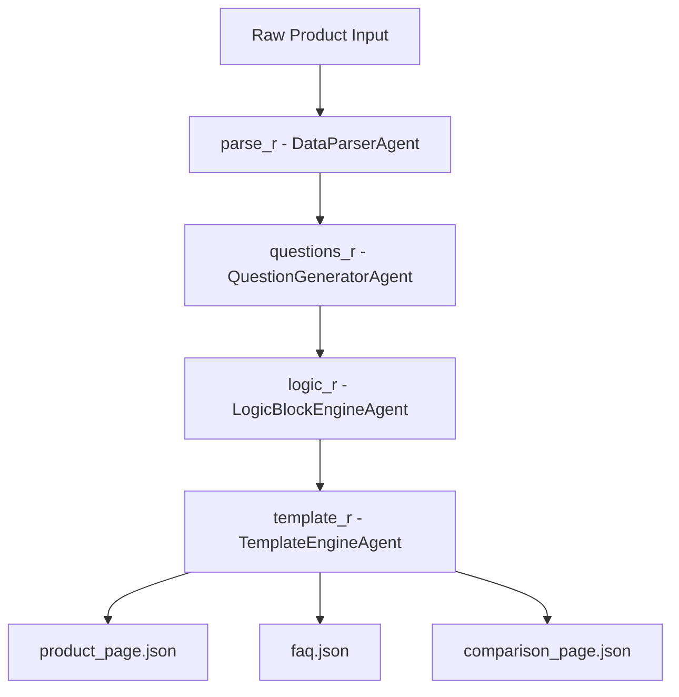

# Multi‑Agent Content Generation System (Final Updated README)

## Overview

This project implements a **modular, deterministic, LangChain‑orchestrated content generation system** that converts a raw product JSON into three structured artifacts:

* `product_page.json`
* `comparison_page.json`
* `faq.json`

It satisfies the requirements of the **Applied AI Engineer Challenge**, emphasizing:

* Zero hallucinations
* Deterministic, testable agents
* Fully traceable LangChain pipeline
* Optional LLM augmentation (via Ollama) **only for paraphrasing**, never fact generation
* Clean separation of concerns between parsing, logic, comparison, and templating

The system ships in **two modes**:

### 🔹 1. Deterministic Mode (Default)

No LLM calls. All text generation is rule‑based and reproducible.

### 🔹 2. LLM‑Augmented Mode (Optional)

Uses the **safe paraphrasing adapter** to rewrite deterministic answers *without altering facts*.
Enabled via environment variable:

```env
USE_OLLAMA=1
```

---

## Project Structure

```
├── agents/
│   ├── data_parser.py
│   ├── question_generator.py
│   ├── logic_engine.py
│   ├── template_engine.py
│   ├── langchain_runnables.py
│   ├── langchain_adapters.py
│   ├── ollama_adapter.py   # optional paraphrasing
├── logic_blocks/
├── templates/
├── tests/
├── inputs/product_input.json
├── outputs/
├── run_pipeline.py
└── README.md
```

---

## System Architecture

The system consists of four core agents wrapped as **LangChain Runnables**:

### 1. **DataParserAgent**

Normalizes raw product JSON → typed `ProductModel`.
Handles:

* fuzzy key matching
* price parsing
* validation

### 2. **QuestionGeneratorAgent**

Deterministically produces the required FAQ onboarding questions.

### 3. **LogicBlockEngineAgent**

Executes modular logic blocks located in `logic_blocks/`:

* product_block
* benefits_block
* usage_block
* safety_block
* ingredients_block
* compare_block
* purchase_block
* faq_answer_block (**refined v2** category‑aware, safe)

This stage also supports **optional paraphrasing** via the LLM adapter.

### 4. **TemplateEngineAgent**

Renders structured JSON outputs from templates.
Supports:

* dynamic field resolution
* fallback rules
* max‑length enforcement
* usage → steps transformation

---

## LangChain Runnable DAG



---

## Execution Flow (High‑Level)

1. **load_input** → product JSON
2. **parse_r.invoke** → structured model
3. **questions_r.invoke** → deterministic FAQ question set
4. **logic_r.invoke** → all logic blocks run, including comparison engine and FAQ v2 answerer
5. **template_r.invoke** → renders JSON outputs
6. **write_outputs** → stored in `outputs/`

Each step is fully logged and traceable.

---

## FAQ Answering Logic (Refined v2)

The FAQ system uses a **6‑category taxonomy**:

* `overview`
* `usage`
* `ingredients` (includes compatibility)
* `safety` (includes skin‑type suitability)
* `value` (price + purchase + value‑for‑money)
* `other` (storage, shelf life, comparison)

### Key Properties

* Zero hallucinations
* Strong question intent matching
* Dedicated compatibility fallbacks
* Deterministic explanations for concentration, suitability, shelf‑life
* Optional LLM paraphrasing with **factual drift detection**

---

## Testing

Run all tests with:

```bash
pytest -q
```

Test coverage includes:

* product parsing
* question generation
* comparison logic (scoring, recommendations)
* FAQ answering (v2 deterministic logic)
* E2E pipeline execution

---

## 🛠 Running the Pipeline

```bash
python run_pipeline.py -i inputs/product_input.json -o outputs/
```

Outputs appear in:

```
outputs/product_page.json
outputs/faq.json
outputs/comparison_page.json
```

---

## Mode Switching (Deterministic ↔ LLM)

### Deterministic Mode

```env
USE_OLLAMA=0
```

### LLM‑Augmented Mode

```env
USE_OLLAMA=1
OLLAMA_BASE=http://localhost:11434
OLLAMA_MODEL=llama3:8b
```

In LLM mode:

* Only paraphrasing occurs
* All factual content comes from deterministic blocks
* Drift detector ensures paraphrases stay faithful

---

## Design Principles

* **Deterministic by default** (99% of the system)
* **Optional LLM augmentation** for natural phrasing
* **Separation of concerns** via well‑scoped agents
* **Composable pipeline** using LangChain Runnables
* **Full transparency** — all stages logged and traceable
* **Safety first** — never generate new facts through LLMs

---

## Extensibility

You can easily:

* Add new logic blocks under `logic_blocks/`
* Extend templates under `templates/`
* Swap LLMs by providing a new paraphrase adapter
* Add new output types (e.g., marketing copy, SEO bullets)

---

## License

For evaluation and demonstration purposes only.

---

For full architecture, execution flow diagrams, and system design documents, refer to the project documentation files in this repository.
